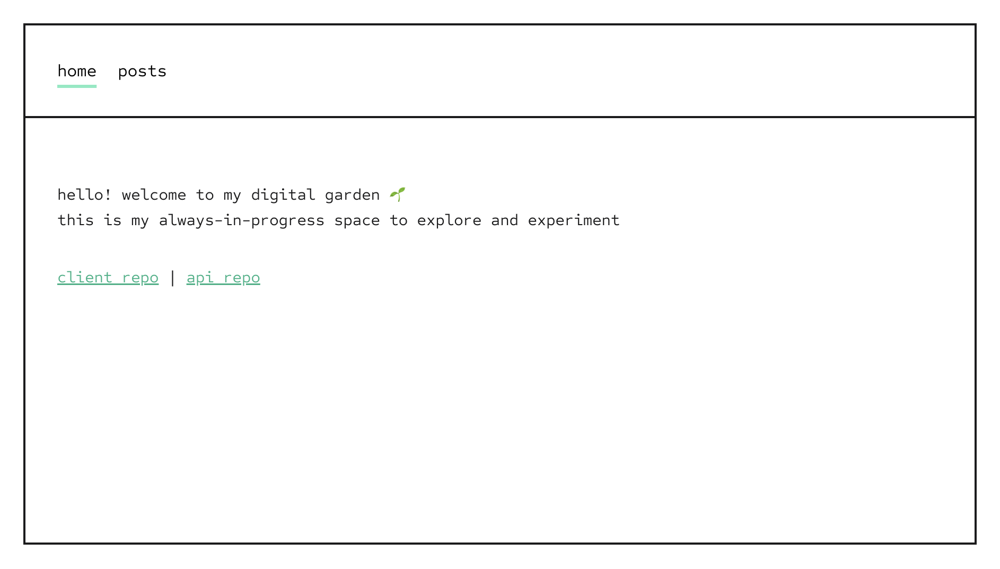
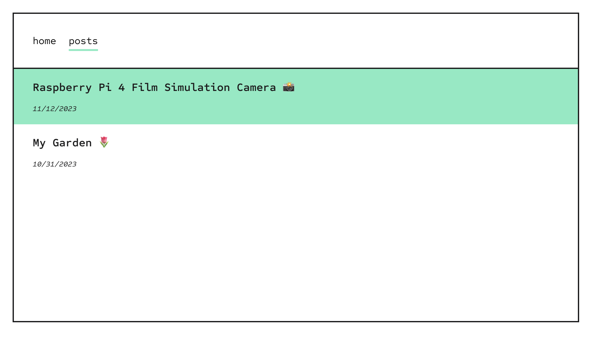
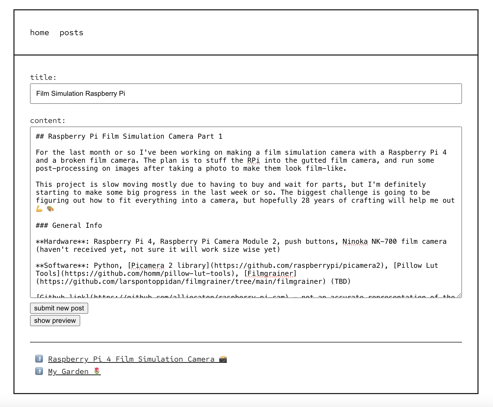

# My Digital Garden 🌷

Welcome to my digital garden! 🌱

[Visit my digital Garden](garden.alliecaton.com)

This website is a hobby space for me to plant thoughts about dev projects, media, and/or whatever else is on my mind. It's pretty minimal right now, and will probably always be minimal, but I do plan to expand on it over time in whatever way feels fun and beneficial.

In addition to the user-facing pages of this site, I also created an authenticated admin area for me to create, edit, and delete posts. It's pretty simple (and not very styled since it's just me who uses it), but I wanted to be able to create posts on mobile, not just locally from my computer or using any third party systems.

You can read more about the creation of this website, the plan, and inspiration [in my first post](https://garden.alliecaton.com/posts/3)

Take a look and smell the flowers 🌻

## Screenshots

